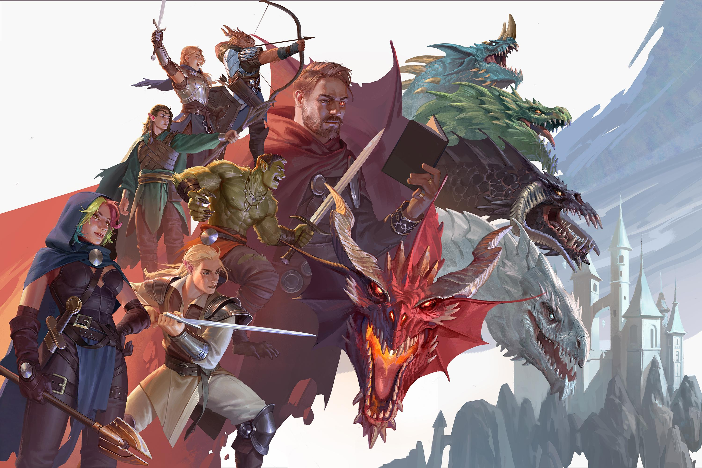

## Set de datos

```{r}
monsters <- readr::read_csv('https://raw.githubusercontent.com/rfordatascience/tidytuesday/main/data/2025/2025-05-27/monsters.csv')
spells <- readr::read_csv('https://raw.githubusercontent.com/rfordatascience/tidytuesday/main/data/2024/2024-12-17/spells.csv')
```

Los datos utilizados son dos bases distintas ambientadas en el mundo fantástico de Dungeons & Dragons edición 2024. La primera base "monsters" contiene detalles sobre los monstruos disponibles en el manual (vida, tipo, debilidades, etc). Mientras que la base "spells" contiene detalles sobre la lista completa de hechizos disponibles para los jugadores (tipo, escuela, clase, etc).


